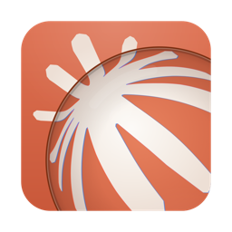
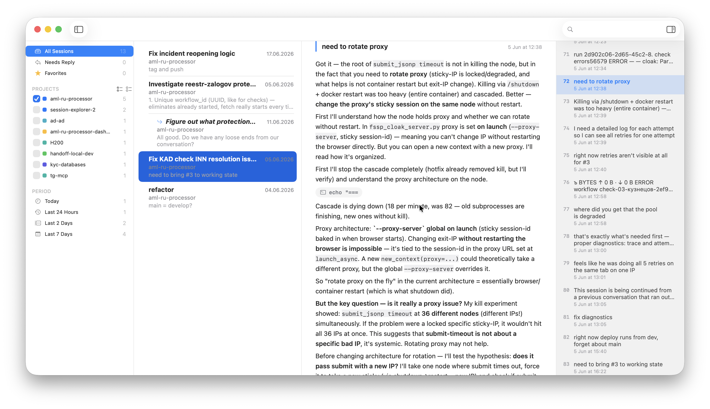
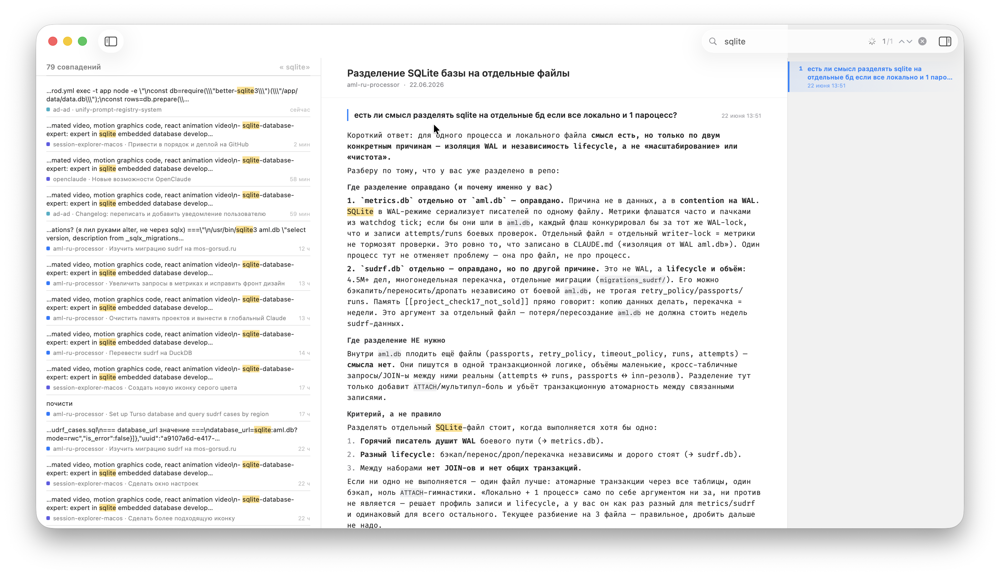

<table>
<tr>
<td></td>
<td>
<h1>Session Explorer (macOS)</h1>
A native macOS app (SwiftUI) for browsing Claude Code sessions
(<code>~/.claude/projects/*.jsonl</code>) — search across every conversation, read
transcripts comfortably, and resume any session in your terminal.
</td>
</tr>
</table>



Full-text search across sessions, with matches highlighted in the list and the
transcript:



## Features

- **Three columns**: a sidebar (All Sessions / Favorites / projects / time
  range), a session list grouped by date (Today / Yesterday / This Week / by
  month), and the conversation view.
- **Titles**: `custom-title` → `ai-title`; when neither exists, a deterministic
  title is generated lazily from the first meaningful prompt (no network/LLM).
- **Fast search** across the full text of sessions: instant matching on
  titles/last replies plus a deep incremental scan of the whole conversation
  (the blob is built lazily and cached). AND semantics across words, plus regex
  via `/pattern/`. Matches are highlighted in both the list and the transcript.
- **Replies (turns)**: adjacent messages from the same side merge into one
  reply (no scatter of avatars); the intermediate tool ping-pong is collapsed
  into a single Claude reply. Tool calls show as a compact line
  `Read³ · Write · ssh · cargo²` and expand on click; tool output is hidden by
  default.
- **Brief mode** (⌘E): hides all tool machinery and intermediate thinking,
  leaving just the replies and the final answer before each reply.
- **Match navigation** (⌘G / ⌘⇧G) and **reply navigation** (⌘[ / ⌘]) with a
  counter capsule.
- **Open in a terminal** (⌘↩): resumes the session by running
  `claude --resume <id>` in the project directory. The terminal is chosen in
  Settings — Ghostty (default), Terminal.app, or iTerm2; for Ghostty the app
  uses AppleScript to focus an already-open tab for that session or to create a
  new one. ⌘⇧C copies the resume command.
- **Realtime**: the sessions directory is watched via FSEvents; the list and the
  open conversation update as Claude Code writes new replies.
- **Inspector** (session details: project, message count, dates, model, ID).

## Build

Requires [XcodeGen](https://github.com/yonyz/XcodeGen) and Xcode.

```sh
xcodegen generate
xcodebuild -project SessionExplorer.xcodeproj -scheme SessionExplorer -configuration Release build
# or open SessionExplorer.xcodeproj in Xcode and hit Run
```

The app runs without the sandbox (it needs access to `~/.claude` and Apple
Events for terminal integration; allow Automation for the chosen terminal on the
first `Open in Terminal`: System Settings → Privacy → Automation).

## Keyboard shortcuts

| Key | Action |
|---|---|
| `⌘↑` / `⌘↓` | previous / next session |
| `↑` / `↓` | navigate replies once the transcript is focused |
| `⌘F` | focus search |
| `Esc` | clear search |
| `⌘↩` | open session in terminal |
| `⌘⇧C` | copy resume command |
| `⌘E` | brief mode |
| `⌘B` | show / hide sidebar |
| `⌘⇧B` | show / hide outline |
| `⌘⇧L` | show / hide session list |
| `⌘G` / `⌘⇧G` | next / previous match |
| `[` / `]` (or `⌘[` / `⌘]`) | previous / next reply |
| `⌃⌘[` / `⌃⌘]` | first / last reply |
| `⌘D` | toggle favorite |
| `⌘⌫` | hide session · `⌃Z` undo hide |
| `⌘⇧R` | reveal in Finder |
| `⌘+` / `⌘-` / `⌘0` | zoom text in / out / reset |
| `⌘⇧T` | triage mode (reply to all in turn) |
| `⌘⌃F` | toggle full screen |

## Architecture

- `Sources/Core/Loader.swift` — parallel (`concurrentPerform`) scan of
  `~/.claude/projects`, parsing jsonl into metadata with an mtime-keyed cache,
  and lazy full-conversation loading with a process-wide cache.
- `Sources/Core/Content.swift` — text extraction from the `message.content`
  shapes, filtering service noise (`<command-*>`, caveats, reminders, etc.).
- `Sources/Core/Search.swift` — two-tier cancellable search (cheap + deep),
  tokens/regex, snippets.
- `Sources/Core/AutoTitle.swift` — lazy heuristic title generation.
- `Sources/Core/OpenSession.swift` — opening a session in a terminal (Ghostty /
  Terminal.app / iTerm2) via AppleScript: `claude --resume <id>` in the project
  directory.
- `Sources/Core/FolderWatcher.swift` — FSEvents watching of the sessions
  directory.
- `Sources/Models/Models.swift` — domain types and reply assembly (`DialogTurn`).
- `Sources/AppModel.swift` — state, filters, and orchestration of search and
  navigation.
- `Sources/Views/` — `RootView`, `SidebarView`, `SessionListView`, `DetailView`,
  `MessageView` (replies + compact tools), `InspectorView`, `Toolbar`.
